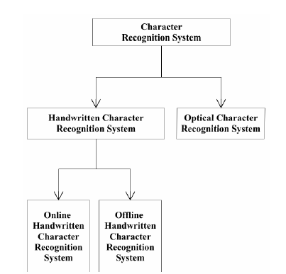
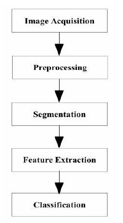

# Digit-Recognition
Handwritten Digit Recognition with opencv and deeplearning4j
<!DOCTYPE HTML PUBLIC "-//W3C//DTD HTML 4.0 Transitional//EN">
<HTML>
<HEAD>
	<META HTTP-EQUIV="CONTENT-TYPE" CONTENT="text/html; charset=utf-8">
	<TITLE></TITLE>
	<META NAME="GENERATOR" CONTENT="LibreOffice 4.1.6.2 (Linux)">
	<META NAME="AUTHOR" CONTENT="sangeeta">
	<META NAME="CREATED" CONTENT="20190217;120900000000000">
	<META NAME="CHANGED" CONTENT="20190620;85625000000000">
	<META NAME="AppVersion" CONTENT="12.0000">
	<META NAME="DocSecurity" CONTENT="0">
	<META NAME="HyperlinksChanged" CONTENT="false">
	<META NAME="LinksUpToDate" CONTENT="false">
	<META NAME="ScaleCrop" CONTENT="false">
	<META NAME="ShareDoc" CONTENT="false">
	
</HEAD>
<BODY LANG="en-US" TEXT="#00000a" LINK="#0000ff" DIR="LTR">

<B>Architecture:</B>

<B>Fig.
Framework of Handwritten Character Recognition System</B>

  

  

  

  

  

  

  

  

  

<B>Modules:</B>

<B>1. Preprocessing</B>

 

The
Preprocessing is performed on acquired input data. It enhances the
quality of input data and makes it more suitable for the next phase
of recognition system. Gray scale conversion, binary conversion,
noise removal, etc. are various techniques that are performed in this
phase.

 

 

<B>2.
Segmentation</B>

 

Segmentation,
is the process of splitting input text data image to line and then
after individual character. It removes the unwanted part from the
data image. There are two types of segmentation available, External
and Internal. External segmentation is segmenting the paragraphs,
lines and words. On the other side internal segmentation is
segmenting of individual character from input text data. Various
algorithms are available for segmentation. Histogram profiles and
connected component analysis are some of the methods for line
segmentation. Spatial space detection for the words and Histogram
method for the characters and other symbols which are used in. For
character segmentation authors are using bounding box technique.
After successful segmentation, resize operation is performed on all
segmented image for uniform size.

 

<B>Fig.
Segmented Line based on Histogram</B>

<B>Fig.
Segmented Characters based on Histogram</B>

<B>3.
Feature Extraction</B>

 

Feature
Extraction is the process of collecting different and very useful
information of an object or a group of objects, so based on that
collected information, we can classify new unknown objects by
matching it. Feature is the robust representation of the raw data.

<B>Fig.
Feature Extraction Techniques</B>

 

<B>4.
Classification</B>

 

Classification
or Recognition process is for decision making, like this new
character fit in which class or looks like. It means, in the phase of
classification characters are identified and assign labeling.
Performance of the classification depends on good feature extraction
and selection. Various classification techniques are available and
they all are ultimately based on image processing and artificial
intelligence.

  

<B>Fig.
Classification Techniques</B>

  

  

  

  

  

  

  

  

  

  

  

  

  

  

<B>Algorithm:</B>

<B>Nearest Neighbor:</B>

The
k-nearest-neighbors algorithm is a classification algorithm, and it
is supervised: it takes a bunch of labelled points and uses them to
learn how to label other points. To label a new point, it looks at
the labelled points closest to that new point (those are its nearest
neighbors), and has those neighbors vote, so whichever label the most
of the neighbors have is the label for the new point (the “k” is
the number of neighbors it checks).

  

</BODY>
</HTML>